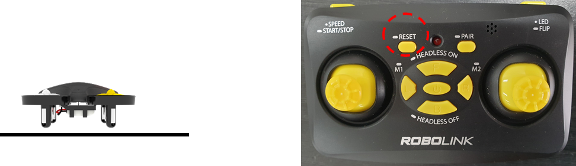
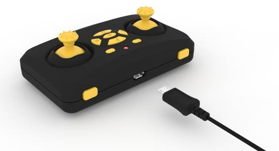
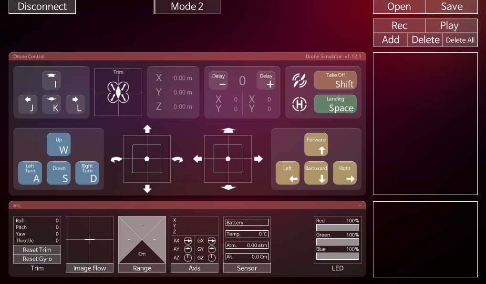

# CoDroneMini CoDrone Mini: Educational Coding Drones

> Coded mini, a smart coding drone that can learn drones and coding!

It is a high performance drone that can be enjoyed by everyone from 8 years old to professionals. Easily code your ideas into block types, click the keyboard buttons and they'll automatically fly as the drone thinks. CoDrone Mini is designed to make drone expert and coding expert easier and safer than the existing CoDrone series. Even if you don't have to start coding hard with textbooks or start with expensive drones, you can start coding and drones at once with CoDrone Mini!

Coding can be done with a variety of open source software, from scratch-type block-based programs to beginners to Python.

# function

The CoDrone Mini has everything the drone should have.

Drones and remote controls allow for a variety of controls and maintenance.

  

# Specifications

## actual configuration

# uses

CoDrone Mini can be enjoyed in four ways: remote control, virtual control, PC monitoring control and block program.

## Remote Control

Drone flight using joystick can be controlled anywhere.

* **Pairing**: The first step is to connect the drone to the remote controller. Power up the drone and shake it in 20 seconds. The drone's LED will then flash blue and red, in which state press the Pairing button on the remote for a few seconds. When connected, the drone's LED will stop and the remote's beep will sound.

* **Reset**: Calibrate the drone on a flat surface. Place the drone on the floor and press the RESET button on the remote control once, then the LED on the drone will react and stop again.

* **Start**: Press the button on the right side for about 4 seconds, the drone will take off and hover automatically

* **Flying**: Use the left joystick to move up/down/left/right and use the right joystick to move forward/backward/left/right.

* **Stop**: Press the button on the right side for about 4 seconds to land at the desired target area and slowly descend to land.

> [Download the Drone Control and Quick Manual PDF](https://github.com/EBWon/manual_en/raw/master/codronemini/pdf/remotecontroller.pdf)

## Drone Simulator Virtual Flight

Virtual drone flying with joystick allows you to control and practice drones on your monitor in a variety of ways without actually flying them.

* **Connection**: Connect the PC and the remote control with a USB cable, run the drone simulator, connect the port from the ConnectC button on the upper right side and press the Training button to go to the virtual drone control screen.

* **Virtual Flight**: Control the drones on your screen with a wired remote like you would control a real drone.

> [Download Drone Simulator PDF Manual](https://github.com/EBWon/manual_en/raw/master/codronemini/pdf/simulator.pdf)

## Drone simulator monitoring flight

You can monitor the drone's various sensor values ​​and drone status through the PC, control the drone using a real keyboard, and even autonomous flight.

* **Connection**: Connect the PC and the remote control with a USB cable, run the drone simulator and connect the port from the ConnectionD button on the upper right side to go to the drone monitoring screen.

* **Play**: You can monitor the status of drones, fly drones with a real keyboard, and even autonomous flight through a sequential flight program tool.

## Rokit Brick

Drag-and-drop block coding programming using the mouse allows you to control a variety of drones, experiments, games and missions.

* **Selection**: Connect PC and remote control with USB cable, run RokitBrick, select CoDrone Mini from drone type and press SELECT button.

* **Connection & Play**: Tap the “CoDrone Mini” tab in the block group at the top left and tap Connect to drones directly below to connect ports and move the desired blocks to the central script to control various drones in real time. can.

> [Download the Rokit Brick PDF Manual](https://github.com/EBWon/manual_en/raw/master/codronemini/pdf/rokit.pdf)
